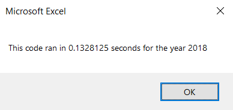

# stock-analysis

## Project Overview

The purpose of this project was to assess the performance of stock portfolios over the 2017 and 2018 years. Several methods were employed, mainly for loops, to parse through and analyze the data. The data was very clean and orderly to begin with, so it was not difficult to work with, nor did it require much restructuring.

## Results

### Portfolio advice
Based on the results in the VBA_Challenge file and pictured below, the portfolio manager made some poor decisions between 2017 and 2018, or potentially there were market fluctuations that caused the stocks to drop in value. Either way, the portfolio should be reassessed asap and more up to date data should be provided for a more thorough analysis.

### Processing times
The worksheets contained the same amount of lines of code and therefore the processing run time would ostensibly be similar. This was in fact observed and captured in the run time dialogue boxes below. Some code was also included to show the methodology.

The previous code for data aggregation and analysis took longer to execute (shown below).

## Summary
An advantage of refactoring code is that you can eliminate some of the processing constraints on the system. A disadvantage is that it takes time to perform and optimize and you could potentially end up with a worse system if not careful.

The improved speed is observed in the data shown above, justifying the additional time taken to refactor the code.
